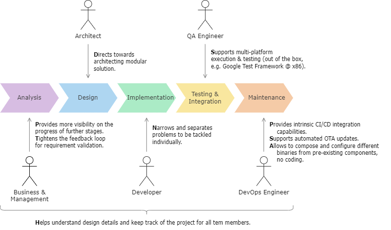

# Dependency Injection Framework - First variant
Further referred to as **diff**.

## Make a difference
Diff is a C++ framework targeted for embedded systems. It provides a structured way to design and implement software - making it **modular**, **maintainable** and **reusable**. 

It supports embedded software development lifecycle from multiple perspectives:

The framework uses [Dependency Injection](https://en.wikipedia.org/wiki/Dependency_injection) design pattern on top of user-provided set of [software components](https://en.wikipedia.org/wiki/Software_component). Components in diff serve as **building blocks** for the final design. Each component provides a solution to a distinct problem, leveraging decomposition. Each is designed and implemented independently. Each can be tested individually and any set of components can be tested together if needed. At the end, the binary is composed of - at that point - **off-the-shelf** components, according to a topology described in **human-readable Json** file. 

## Diff components, modules and instances
Diff operates on two component types:
- _[regular]_ **Component** is a single C++ class which encapsulates a specific functionality. It holds the implementation. Its internal architecture may be complex, utilizing various other classes and libraries. The class itsself will only be only visible to the framework. If certain functionality needs to be exposed or utilized by it, it must be done by implementing or consuming an _interface component_.
- **Interface Component** is a single abstract class which determines how certain functionality shall be used. It does not consist of the information on how it is implemented. The functionality represented by an interface component can be either implemented and/or consumed by a regular component. Interface components serve as joint points between regular components. For this reason they only consist of the minimal amount of code (to make it bug-proof) - ideally being just an abstract interface.

**Module** is a physical representation of a component. Regular components are shipped in form of static or dynamic libraries. Since interface components are just interface declarations, they come in the form of header-only libraries. Diff refers to all these libraries as _modules_. They are a subject for versioning and dependency management, but the exact tools used (e.g. CMake, Conan 2) are up to the team and the project. 

Each module can be built and tested on its own. There is no dependency chain, as _components_ only depend on _interface components_ and its internally used tools. 

Framework creates **Component Instances** to compose a hierarchy required by the application. Each _component_ can be instantiated multiple times.

## Requirements
Diff requires **C++14** or higher. It utilizes both the language features and also several STL containers provided by the standard. 

As of today the choice of C++14 is a sweet point between taking advantage of modern C++ features and ensuring that almost all targeted toolchains provide the required standard (which is not necessarily true for C++17, yet). 

## Applicability
The framework is a composition of multiple design patterns, some simple, others pretty complex. The first and main principle behind diff is to only rely on C++ standard. This makes its implementation robust and platform-independent. There may be cases where integration with a specific toolchain requires additional investigation and one-off work, but as verified so far - every tested setup was able smoothly support a diff-based application:

<table><thead>
  <tr>
    <th>OS \ Architecture</th>
    <th>x86-32/64</th>
    <th>ARM</th>
    <th>Risc-V</th>
  </tr></thead>
<tbody>
  <tr>
    <td>QNX Neutrino</td>
    <td></td>
    <td>✅ qcc</td>
    <td></td>
  </tr>
  <tr>
    <td>VxWorks</td>
    <td>✅ gcc</td>
    <td></td>
    <td></td>
  </tr>
  <tr>
    <td>Windows</td>
    <td>✅ msvc</td>
    <td></td>
    <td></td>
  </tr>
  <tr>
    <td>Linux</td>
    <td>✅ gcc, clang</td>
    <td></td>
    <td>✅ gcc</td>
  </tr>
  <tr>
    <td>Bare-metal</td>
    <td></td>
    <td>✅ armcl</td>
    <td>✅ gcc</td>
  </tr>
</tbody>
</table>

